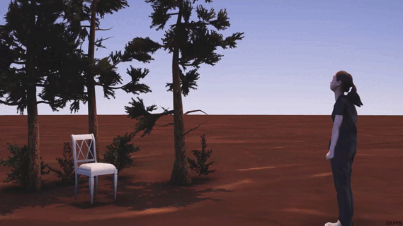

<p style="text-align: center;">
    
</p>


This repostory contains code and data instructions for [ROAM: Robust and Object-aware Motion Generation using Neural Pose Descriptors](https://vcai.mpi-inf.mpg.de/projects/ROAM/).

# Setup Instruction
## Step 1: Clone the Repository
```
git clone ...
cd ROAM
```
If you are only interested in running the Unity demo, you can skip Step 2, Step 3 and Data Instruction, and directly go to [Roam Unity](#unity).

## Step 2: Create New Conda Environment
```
conda create --name roam_env python=3.9
conda activate roam_env
conda install pytorch==1.12.1 torchvision==0.13.1 torchaudio==0.12.1 cudatoolkit=11.3 -c pytorch -c nvidia
conda install -c fvcore -c iopath -c conda-forge fvcore iopath
conda install -c bottler nvidiacub
conda install pytorch3d -c pytorch3d
```

## Step 3: Install Requirements
```
pip install -r requirements.txt
cd NDF
git clone https://github.com/20tab/bvh-python.git
cd bvh-python
pip install .
```


# Data Instruction
This section contains instruction for the type of data you need to download to run or retrain different components of our method.
You do not need to download any data to run our Unity demo. 
However, if you would like to retrain l-NSM model, re-process the data or optimizes goal poses, please download the respective zip files from [ROAM dataset](https://edmond.mpg.de/dataset.xhtml?persistentId=doi:10.17617/3.LR9CAS) following the instructions below. 

If you would like to
- re-train l-NSM using our preprocessed data, please download l_nsm_data_processed.zip from [ROAM dataset](https://edmond.mpg.de/dataset.xhtml?persistentId=doi:10.17617/3.LR9CAS), unzip it and put the folder in data/ 
- use preprocessed motion capture assets in Unity, please download MotionCapture.zip from [ROAM dataset](https://edmond.mpg.de/dataset.xhtml?persistentId=doi:10.17617/3.LR9CAS), unzip it and put the folder MotionCapture in Roam_Unity/Assets/
- download our raw motion data in BVH format, please download 	
mocap_raw_data.zip from [ROAM dataset](https://edmond.mpg.de/dataset.xhtml?persistentId=doi:10.17617/3.LR9CAS)

To run our Goal Pose Optimization module, please download the reference poses, objects and a subset of shapenet dataset with occupancy labels.
Only the chair (ID: 03001627) and sofa (ID: 04256520) categories are used in the paper.
- To select reference poses for NDF optimization, please download ndf_data.zip from [ROAM dataset](https://edmond.mpg.de/dataset.xhtml?persistentId=doi:10.17617/3.LR9CAS), unzip it and put it under the data folder. Inside data/ndf_data/ref_motion, there is a blender file which contains reference poses and objects for visualization and reference pose selection. 
- download preprocessed data from [occupancy network](https://github.com/autonomousvision/occupancy_networks) and rename the folder as shapenet_pointnet and put it under data/ndf_data/
- download [ShapeNet V1](https://shapenet.org/download/shapenetcore) for the corresponding meshes needed for visualization; rename the folder as shapenet_mesh and put it under data/ndf_data/


Overall, The file structure should look like: 
```
ROAM/data/
         ndf_data/
                 ref_meshes/
                 ref_motion/
                 ref_objects/
                 shapenet_mesh/
                              03001627/
                              04256520/
                 shapenet_pointcloud/
                              03001627/
                              04256520/         
         l_nsm_data_processed/
         mocap_raw_data/
    Roam_Unity/
              Assets/
                    MotionCapture/
```


# Code 
There are three main components: 
- Roam_Unity: contains inference, demos and data processing code
- L_NSM: contains code to train I-NSM
- NDF: contains goal pose optimization code

<a id="unity"></a>

## Roam Unity
Unity version: 2021.3.14 (tested on Windows 10)

Open the Demo Scene (Roam_Unity -> Assets -> Scenes -> RoamDemo.unity).

We provide both high-level and low-level modes. 

In the high-level mode, the pipeline runs automatically after hitting the Play button with randomly sampled novel objects from the test set as well as optimized poses from randomly sampled reference poses. 

<p style="text-align: center;">
    
</p>

To enable low-level mode, please disable the HighLevel option from the Roam_Demo interface and enable the LowLevel object collections. 
- Hit the Play button.
- Move around with W,A,S,D (Move), Q,E (Turn)
- Once close to the object, press either C for sitting down, or L for lying down. 
- Feel free to import novel objects and optimized poses from the NDF module!

<p style="text-align: center;">
    
</p>

QuantEval.unity is a challenging setup which we used for our quantitative evaluation. The novel objects are randomly sampled from ShapeNet test set and the reference poses are also randomly sampled. 

### Motion Re-export
If you want to visualize the annotated motion capture assets or re-export the motion as txt files for l-NSM training, please make sure you have downloaded download [MotionCapture.zip](https://edmond.mpg.de/dataset.xhtml?persistentId=doi:10.17617/3.LR9CAS) following the instruction from Data Instruction.

The folder structure should look like:
```
Roam_Unity/Assets/MotionCapture/
                            forward0327/
                            lie_transition_25fps/
                            lie_walk_25fps/
                            random_0327/
                            side_0327/
                            sit_sofa_transition_25fps/
                            sit_sofa_walk_25fps/
                            transition171122/
```

Open MotionProcess.Unity under the Scenes folder and it contains the motion processing interface with the annotated eight sequences which we exported for L_NSM training.

To re-export, please navigate to AI4Animation -> Motion Exporter in the menu bar. 

### Retrain l-NSM:
```
cd L_NSM
python main.py --config l_nsm.yaml
```

## Goal Pose Optimization
### Running Optimization Using Pretrained Models:
```
cd NDF
```
#### Chair Sit 
```
python optimize_main.py --category "chair" --sequence_name "chair_sit" --shapenet_id f2e2993abf4c952b2e69a7e134f91051 --ref_pose_index 10 --novel_obj_angle -70 --exp_name "chair_demo"
```
#### Sofa Sit 
```
python optimize_main.py --category "sofa" --sequence_name "sofa_sit" --shapenet_id 824953234ed5ce864d52ab02d0953f29 --ref_pose_index 100 --novel_obj_angle 30 --exp_name "sofa_sit_demo"
```
#### Sofa Lie
```
python optimize_main.py --category "sofa" --sequence_name "sofa_lie" --shapenet_id 2e12af86321da41284e6e639680867d1 --ref_pose_index 30 --novel_obj_angle 50 --exp_name "sofa_lie_demo"
```
### Explanation of Output
To examine the output: load *.obj file and *.bvh into Blender.
In Blender, you can visualize the optimization process for 0 to 500 iterations.
If you want to see the motion result on this object and optimized pose, you need to load both .*obj and final_pose_unity.txt is loaded into the Unity project. 

### Optimize Other Poses and Objects
You can open the blender file under data/ndf_data/ref_motion to obtain the indices for other references poses.
You can select the objects according to the images in data/ndf_data/shapenet_mesh.

### Re-train NDF:
```
cd NDF/NDFNet
python train_vnn_occupancy_net.py --obj_class chair --experiment_name ndf_chair_model_opensource
python train_vnn_occupancy_net.py --obj_class sofa --experiment_name ndf_sofa_model_opensource
```

# Acknowledgement
Parts of our code are adapted from [AI4Animations](https://github.com/sebastianstarke/AI4Animation), 
[Couch](https://github.com/xz6014/couch/) and
[Neural Descriptor Fields](https://github.com/anthonysimeonov/ndf_robot).
We thank the authors for making the code public. 

# Citation
```
@article{zhang2024roam,
    title = {ROAM: Robust and Object-aware Motion Generation using Neural Pose Descriptors},
    author = {Zhang, Wanyue and Dabral, Rishabh and Leimk{\"u}hler, Thomas and Golyanik, Vladislav and Habermann, Marc and Theobalt, Christian},
    year = {2024},
    journal={International Conference on 3D Vision (3DV)}
}
```